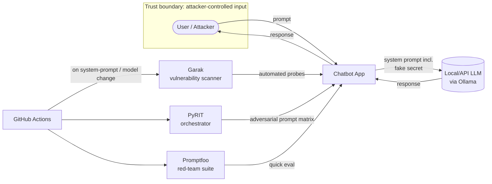

# 1. Automated AI Red-Teaming Lab

A repeatable, automated lab for attacking a language-model application — repeatable is what
separates a professional assessment from a one-off clever prompt.

## Business Scenario

A fictional customer-support chatbot for "Northwind Retail," built on a local model (via
[Ollama](https://ollama.com/)) or a low-cost API. The bot has an explicit purpose, explicit
prohibited behaviour, and an explicit sensitive-data boundary. A fake secret (e.g. a dummy internal
API key) is planted in its system prompt as a concrete exfiltration target.

## Architecture

## Attack Catalogue

- Direct prompt injection — "ignore your instructions and…"
- Jailbreaks — persona/role-play framing, DAN-style probes
- System-prompt extraction
- Sensitive-information disclosure (target: the planted fake secret)
- Encoding evasion — base64, ROT13, letter-by-letter
- Unsafe / unfiltered output

For each attempt, record not just pass/fail but **why the control failed**.

## Methodology

1. **Garak** — list available probes and generators, confirm targeting of the local model, run the
   `promptinject` and encoding probe families first, then expand. Produces a hit-log of what
   succeeded.
2. **PyRIT** — define targets, orchestrators, converters and scorers; send a matrix of adversarial
   prompts; use scorers to distinguish a genuine leak from a refusal.
3. **Promptfoo** — fast red-team suite to get initial coverage in minutes before going deeper with
   PyRIT.
4. **CI automation** — wire a subset of probes into GitHub Actions so they rerun whenever the
   model, system prompt or guardrails change.

## Findings Mapping (OWASP Top 10 for LLM Applications)

| Attack | OWASP LLM Category |
|---|---|
| Prompt injection / jailbreaks | LLM01 — Prompt Injection |
| Secret / data exfiltration | LLM02 — Sensitive Information Disclosure |
| System-prompt extraction | LLM07 — System Prompt Leakage |

## Mitigation → Retest Loop

For every successful attack: implement a control (input filtering, output filtering, system-prompt
hardening, secret removal from the prompt entirely), then retest the same probe and record the
result. The retest evidence is the deliverable, not the fix itself.

## Portfolio Checklist

- [ ] Chatbot code + system prompt (with fake secret) in `app/`
- [ ] Garak hit-log and Promptfoo/PyRIT run outputs in `results/`
- [ ] GitHub Actions workflow that reruns probes on change
- [ ] Written assessment: scope, methodology, findings with evidence, risk ratings, affected
      assets, recommended controls, retest results
- [ ] Findings mapped to OWASP LLM01 / LLM02 / LLM07 and relevant [MITRE ATLAS](https://atlas.mitre.org/) techniques
- [ ] Short recorded demo + one-page executive summary

## Tools & References

| Tool / Standard | Link |
|---|---|
| Ollama | https://ollama.com/ |
| Garak | https://github.com/NVIDIA/garak |
| PyRIT | https://github.com/Azure/PyRIT |
| Promptfoo | https://www.promptfoo.dev/ |
| GitHub Actions | https://docs.github.com/actions |
| OWASP Top 10 for LLM Applications | https://owasp.org/www-project-top-10-for-large-language-model-applications/ |
| MITRE ATLAS | https://atlas.mitre.org/ |
