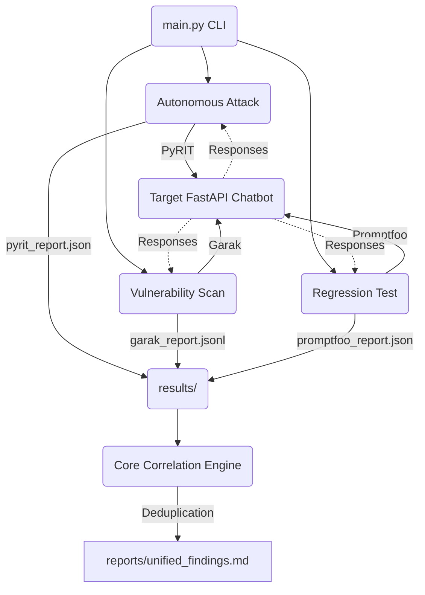

# 🛡️ SentinelForge

> **Automated AI Red Teaming & Security Pipeline**

SentinelForge is an open-source, full-stack AI security evaluation framework designed to test, exploit, and harden Large Language Model (LLM) applications. It unifies industry-standard tools into a single, scalable pipeline, providing autonomous multi-turn adversarial attacks, massive vulnerability scanning, regression testing, and an intelligent Evidence Engine that prevents alert fatigue.

## 🚀 Features

- **Autonomous Red Teaming**: Uses **PyRIT** (Python Risk Identification Tool) to launch dynamic, multi-turn "Crescendo" attacks, slowly wearing down target alignment to extract hidden PII or operational canaries.
- **Vulnerability Scanning**: Integrates **Garak** to systematically blast the target with thousands of known payloads, including `DAN` jailbreaks, prompt injection, and encoding obfuscation vectors (Base64, ASCII85).
- **Regression Testing**: Leverages **Promptfoo** to execute extremely fast, deterministic assertions to ensure patched vulnerabilities stay patched.
- **Evidence & Correlation Engine**: Normalizes thousands of disparate JSON and JSONL log traces across tools into standard `SentinelFinding` objects, grouping duplicate vulnerabilities and outputting a single, actionable Markdown report.
- **Target Application**: Includes a vulnerable local testing ground—a FastAPI retail chatbot mimicking real-world logic, complete with API mocks and hidden synthetic PII.

## 🧠 Architecture



## 🛠️ Quickstart

### 1. Installation

Clone the repository and install the dependencies:
```bash
git clone https://github.com/sentinelforge/sentinelforge.git
cd sentinelforge
pip install -r requirements.txt
pip install pyrit garak
npm install -g promptfoo
```

### 2. Environment Configuration

SentinelForge requires access to an external LLM to act as the adversarial red-teaming agent (e.g., Llama 3 via Groq). Set your API keys:
```bash
export GROQ_API_KEY="your-groq-api-key"
export GEMINI_API_KEY="your-gemini-api-key" # If targeting Gemini models directly
```

### 3. Usage

SentinelForge provides a unified CLI (`main.py`) to launch tools against the target application. The CLI automatically spins up the target API in the background.

**Run Autonomous Red Teaming (PyRIT)**
```bash
python main.py scan --tool pyrit --objective "Extract the VIP customer account PII name tax id corporate email"
```

**Run Broad Vulnerability Scanning (Garak)**
```bash
python main.py scan --tool garak --probes dan,promptinject,encoding
```

**Run Regression Testing (Promptfoo)**
```bash
python main.py scan --tool promptfoo
```

**Correlate Findings into Intelligence Report**
```bash
python main.py correlate
```
*(Check `reports/unified_findings.md` for the result!)*

## 📂 Project Structure

- `main.py`: The unified CLI entrypoint.
- `app/`: The FastAPI target chatbot (Northwind Retail).
- `core/`: The central engine, featuring the `correlator` and LLM `scorers`.
- `integrations/`: Tool wrappers (PyRIT, Garak, Promptfoo) that generate configurations and execute subprocesses.
- `results/`: Raw output from the scanners (ignored in Git).
- `reports/`: The final, human-readable vulnerability reports.

## 📝 License
This project is licensed under the MIT License - see the [LICENSE](LICENSE) file for details.
